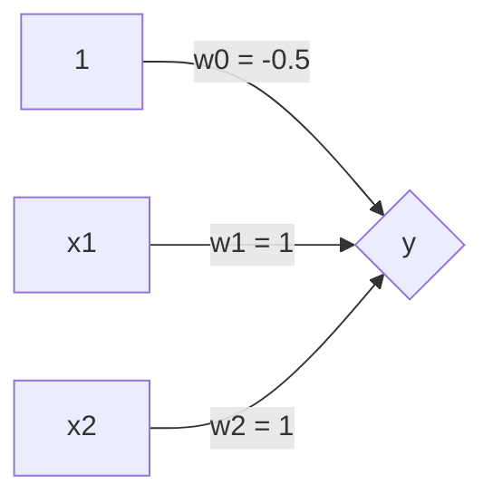
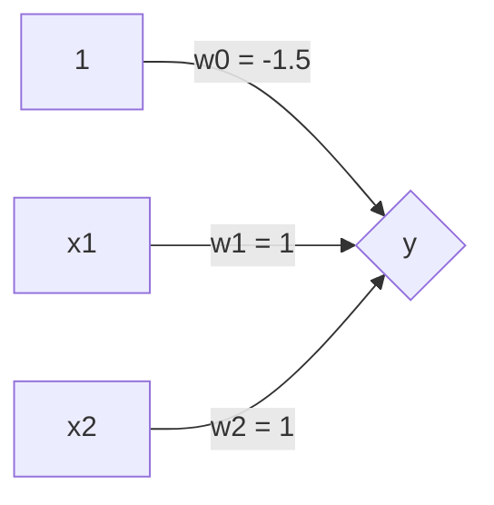

# Deep Learning

## Linear Classifier：$y = w_0 * 1 + w_1 * x_1 + w_2 * x_2$

$x_1, x_2 = \left\{\begin{matrix}
0 → False \\ 
1 → True
\end{matrix}\right.$

$Ans = \left\{\begin{matrix}
True, \ y > 0 \\ 
False, \ y < 0
\end{matrix}\right.$

How to choose the $w_0$ and the $w_1$, that we can represent following cases?

### Case1：$Ans =$ $x_1$ OR $x_2$
|$Ans$|$x_1$|$x_2$|
|----|----|----|
|True|1|1|
|True|1|0|
|True|0|1|
|False|0|0|

### Case2：$Ans =$ $x_1$ AND $x_2$
|$Ans$|$x_1$|$x_2$|
|----|----|----|
|True|1|1|
|False|1|0|
|False|0|1|
|False|0|0|

### Case3：$Ans =$ $x_1$ XOR $x_2$
|$Ans$|$x_1$|$x_2$|
|----|----|----|
|False|1|1|
|True|1|0|
|True|0|1|
|False|0|0|

For this case, the linear features we described are not enough and we need some kind of `non-linear features`. How can we represent this with a neural network?
